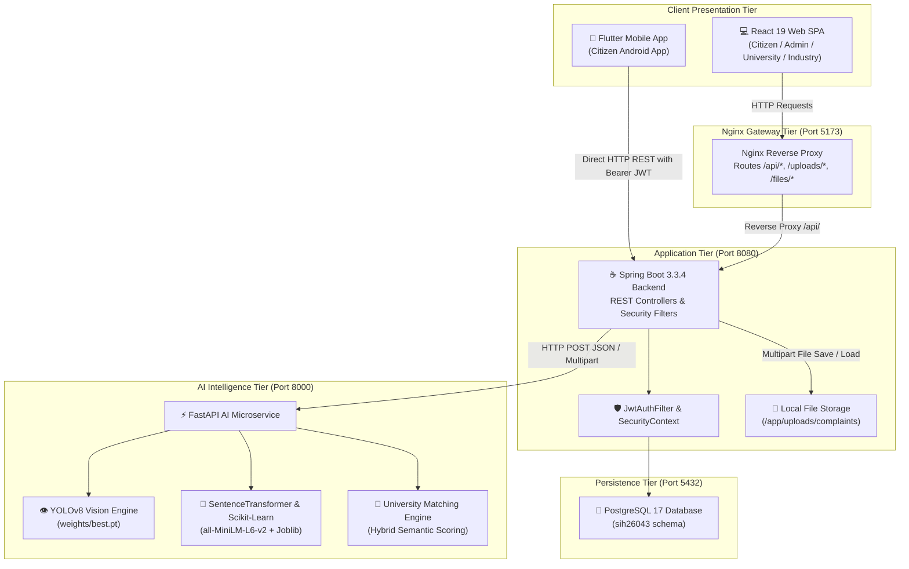

# JanNirikshan — Civic Intelligence & R&D Collaboration Platform

[](https://sih.gov.in)
[](https://spring.io/projects/spring-boot)
[](https://react.dev)
[](https://fastapi.tiangolo.com)
[](https://ultralytics.com)
[](https://flutter.dev)
[](https://www.postgresql.org)
[](https://www.docker.com)
[](LICENSE)

> **JanNirikshan (SIH26043)** is an end-to-end civic intelligence and research-driven governance ecosystem developed for the **Smart India Hackathon (SIH 2026)**. It connects **Citizens**, **Municipal Authorities / Government Bodies**, **Premier Technical Universities (IITs/NITs)**, and **Industrial Partners** into an automated problem-solving pipeline.

---

## 📑 Table of Contents
1. [Project Overview](#1-project-overview)
2. [SIH Problem Statement](#2-sih-problem-statement)
3. [The Problem](#3-the-problem)
4. [The Solution](#4-the-solution)
5. [Key Innovation (The Triple-Helix Model)](#5-key-innovation-the-triple-helix-model)
6. [Target Stakeholders](#6-target-stakeholders)
7. [Complete End-to-End Workflow](#7-complete-end-to-end-workflow)
8. [System Architecture](#8-system-architecture)
9. [Technology Stack](#9-technology-stack)
10. [Repository Structure](#10-repository-structure)
11. [Subsystems Overview](#11-subsystems-overview)
    - [Frontend (React 19 + Vite)](#frontend-react-19--vite)
    - [Backend (Spring Boot 3.3.4)](#backend-spring-boot-334)
    - [AI Intelligence Engine (FastAPI + PyTorch)](#ai-intelligence-engine-fastapi--pytorch)
    - [Database (PostgreSQL 17)](#database-postgresql-17)
    - [Mobile Citizen App (Flutter)](#mobile-citizen-app-flutter)
12. [AI Intelligence Engine Deep Dive](#12-ai-intelligence-engine-deep-dive)
    - [Computer Vision & YOLOv8](#computer-vision--yolov8)
    - [Image Safety Guardrail](#image-safety-guardrail)
    - [NLP Domain & Issue Classification](#nlp-domain--issue-classification)
    - [Duplicate Detection & 100m GPS Clustering](#duplicate-detection--100m-gps-clustering)
    - [Priority Prediction](#priority-prediction)
    - [University Capability Matching](#university-capability-matching)
13. [API Architecture & Integration](#13-api-architecture--integration)
14. [Authentication & Security](#14-authentication--security)
15. [Docker Microservices Setup](#15-docker-microservices-setup)
16. [Local Development Setup](#16-local-development-setup)
17. [Demo Credentials & SIH Walkthrough](#17-demo-credentials--sih-walkthrough)
18. [Current Implementation Status](#18-current-implementation-status)
19. [Known Limitations & Future Scope](#19-known-limitations--future-scope)
20. [License & Team](#20-license--team)

---

## 1. Project Overview

JanNirikshan transforms traditional civic complaint management from simple grievance tracking into a **collaborative national engineering network**. When a citizen submits a photographic report of a structural defect (e.g., severe road cratering, broken power infrastructure, waste accumulation), the platform:
- **Validates the defect in real time** using deep learning computer vision (YOLOv8).
- **Filters spam and inappropriate uploads** through safety guardrails.
- **Clusters duplicate reports** within a 100m geodesic radius.
- **Assesses priority** using multi-factor tabular machine learning.
- **Matches recurring or complex civic challenges** to specialized university research laboratories (IITs/NITs) capable of developing sustainable, long-term engineering solutions.
- **Engages industrial CSR & R&D partners** to fund, co-develop, and deploy scalable solutions.

---

## 2. SIH Problem Statement

**Problem ID**: SIH26043  
**Title**: Digital Platform to Crowdsource Societal Challenges and Facilitate Collaborative Problem Solving  
**Objective**: Build a national digital platform enabling citizens to report societal challenges while facilitating multi-stakeholder collaboration among government departments, academic institutions, and industrial technology providers.

---

## 3. The Problem

1. **High Influx, Poor Triage**: Municipal bodies receive thousands of unverified or vague complaints daily without structured defect classification.
2. **Superficial Fixes vs. Root Causes**: Severe recurring civic defects (e.g. chronic road potholes, water salinity, transformer failures) receive repetitive, costly temporary patches instead of durable engineering solutions.
3. **Siloed Stakeholders**: Academic institutions and universities possess advanced research capabilities but lack structured digital pipelines to discover real-world municipal problems.
4. **Lack of Industrial Co-Funding**: Corporate CSR funds and infrastructure technology providers lack verifiable, high-impact civic R&D projects to support.

---

## 4. The Solution

JanNirikshan delivers a unified digital ecosystem featuring:
- **Mobile First Citizen Reporting**: Cross-platform Flutter mobile app with camera integration, GPS localization, and one-tap AI form drafting.
- **AI-Powered Validation & Triage**: Ultralytics YOLOv8 defect detection, SentenceTransformer NLP embeddings, tabular priority prediction, and geodesic duplicate clustering.
- **University R&D Marketplace**: Dedicated portal where universities browse municipal challenges, form faculty-student research teams, and execute milestone-based R&D.
- **Industry Co-Funding Gateway**: Corporate CSR module for funding allocations, progress tracking, and measurable societal impact validation.

---

## 5. Key Innovation: The Triple-Helix Model

```
       🏛️ GOVERNMENT / ULBs
       (Problem Owners & Municipal Deployment)
               ▲
              / \
             /   \
            /     \
           ▼       ▼
🎓 ACADEMIA (IITs/NITs) ◄──► 🏭 INDUSTRY & CSR
(Research, Faculty & Students)  (Funding, Materials & Scaling)
```

---

## 6. Target Stakeholders

| Stakeholder Role | Portal / App | Key Responsibilities |
| :--- | :--- | :--- |
| **ROLE_CITIZEN** | Mobile App / Web | Report civic defects, capture photos, auto-fill details via AI, track resolution timeline. |
| **ROLE_GOVERNMENT / OFFICER** | Web Portal | Review AI-verified complaints, approve municipal work orders, escalate structural challenges to universities. |
| **ROLE_ADMIN** | Web Portal | Platform oversight, audit logging, system configuration, department/university onboarding. |
| **ROLE_UNIVERSITY** | Web Portal | Browse engineering challenges, accept problem statements, allocate research capacity. |
| **ROLE_FACULTY** | Web Portal | Lead R&D projects as Principal Investigators (PIs), create proposals, mentor student researchers. |
| **ROLE_STUDENT** | Web Portal | Execute laboratory tasks, submit milestone deliverables, develop engineering prototypes. |
| **ROLE_INDUSTRY** | Web Portal | Discover validated university projects, commit CSR co-funding, provide industrial field testing. |

---

## 7. Complete End-to-End Workflow

```
[1. Citizen Submits Defect with Photo & GPS]
                  │
                  ▼
[2. AI Vision Guardrail & YOLOv8 Detection]
    ├── Image Safety (Blank/NSFW/Dark check)
    └── YOLOv8 Defect & Severity Localization
                  │
                  ▼
[3. NLP Classification & Geodesic Deduplication]
    ├── 9-Domain Governance Classification
    └── 100m GPS Cluster & Priority Escalation
                  │
                  ▼
[4. Municipal Triage & AI University Matching]
    ├── Standard Defect -> Municipal Work Order
    └── Complex Engineering Defect -> AI University Match (IITs/NITs)
                  │
                  ▼
[5. University Acceptance & R&D Project Formation]
    ├── Lead Faculty (PI) accepts challenge
    ├── Recruits student research team
    └── Defines verifiable milestones
                  │
                  ▼
[6. Industry CSR Sponsorship & Co-Funding]
    ├── Industry expresses partnership interest
    └── Allocates CSR / R&D grant
                  │
                  ▼
[7. Milestone Execution, Field Pilot & Impact Report]
    ├── Prototypes built & tested in lab
    ├── Municipal field deployment
    └── Societal impact quantified & complaint resolved
```

---

## 8. System Architecture



---

## 9. Technology Stack

| Layer | Technology | Version | Purpose |
| :--- | :--- | :--- | :--- |
| **Backend** | Spring Boot | 3.3.4 (Java 17) | Core REST API, business logic, security filter chain. |
| **Build Tool** | Apache Maven | 3.9.x | Backend compilation & packaging. |
| **Security** | Spring Security + JJWT | 0.12.5 | Stateless JWT authentication, BCrypt password hashing. |
| **Database** | PostgreSQL | 17-alpine | Relational persistence, geospatial queries, foreign key integrity. |
| **ORM** | Spring Data JPA (Hibernate) | 3.3.4 | JPA repositories and entity mapping. |
| **AI Framework** | FastAPI + Uvicorn | 0.100.0 / 0.22.0 | Python async microservice serving all AI endpoints. |
| **Vision Model** | Ultralytics YOLOv8 | 8.0.0+ (PyTorch 2.0+) | Defect object detection (`ai_service/weights/best.pt`). |
| **NLP** | SentenceTransformers | 2.2.0+ (`all-MiniLM-L6-v2`) | Dense semantic embeddings (384 dimensions). |
| **Tabular ML** | Scikit-Learn + Joblib | 1.2.0+ | Domain & priority classifiers. |
| **Geospatial** | Geopy | 2.3.0+ | Geodesic / haversine calculations for duplicate detection. |
| **Web Frontend** | React | 19.1.1 (Vite 7.1.3) | Single Page Application. |
| **Web Routing** | React Router | 7.8.2 | Client-side routing with role-based route guards. |
| **Web Maps** | Leaflet + React-Leaflet | 1.9.4 / 5.0.0 | Interactive OpenStreetMap tile maps with clustering markers. |
| **Mobile App** | Flutter / Dart | Dart SDK ^3.13.2 | Cross-platform mobile citizen app. |
| **Mobile State** | Provider | 6.1.2 | Reactive state management. |
| **Mobile HTTP** | Dio | 5.7.0 | HTTP client with multipart and Bearer token interceptor. |
| **Mobile Maps** | Flutter Map + Geolocator | 7.0.2 / 13.0.1 | OpenStreetMap rendering & native GPS coordinates. |
| **Container** | Docker + Compose | 3.8+ | 4-container microservice orchestration. |

---

## 10. Repository Structure

```
SIH26043/
├── README.md                         # Main repository documentation
├── LICENSE                           # MIT License
├── .gitignore                        # Production Git ignore rules
├── .env.example                      # Template environment variables (safe placeholders)
├── docker-compose.yml                # Docker compose orchestration (4 containers)
├── DOCKER_README.md                  # Container administration guide
│
├── docs/                             # Dedicated architectural documentation
│   ├── architecture.md               # End-to-end system architecture
│   ├── frontend.md                   # React web application guide
│   ├── backend.md                    # Spring Boot backend guide
│   ├── ai.md                         # FastAPI AI intelligence engine guide
│   ├── database.md                   # PostgreSQL schema & entity relationships
│   ├── mobile.md                     # Flutter citizen mobile application guide
│   ├── api.md                        # Complete REST API reference
│   ├── deployment.md                 # Production deployment & cloud architecture
│   └── development.md                # Developer onboarding & setup guide
│
├── frontend/                         # React 19 + Vite Web Application
│   ├── package.json
│   ├── vite.config.js
│   ├── nginx.conf
│   ├── Dockerfile
│   └── src/
│       ├── context/                  # AuthContext.jsx, AppContext.jsx
│       ├── services/                 # 20 Modular Axios API clients
│       ├── components/               # Maps, layout, evidence, analytics widgets
│       └── pages/                    # 13 Role-specific page modules
│
├── backend/                          # Spring Boot 3.3.4 Java Backend
│   ├── pom.xml
│   ├── Dockerfile
│   └── src/main/
│       ├── resources/
│       │   └── application.properties
│       └── java/com/jannirikshan/
│           ├── admin/                # AdminController & AdminService
│           ├── ai/                   # AiClient, AiController, AiService, AiPrediction
│           ├── analytics/            # AnalyticsController & AnalyticsService
│           ├── audit/                # AuditController, AuditLog, AuditRepository
│           ├── auth/                 # AuthController, AuthService, JWT classes
│           ├── citizen/              # CitizenController & CitizenProfile
│           ├── complaint/            # Complaint entity, controller, service, repo
│           ├── config/               # SecurityConfig, CorsConfig, StorageConfig
│           ├── evidence/             # Evidence entity, controller, service
│           ├── faculty/              # Faculty entity, controller, service
│           ├── file/                 # FileController (binary file serving)
│           ├── industry/             # Industry entity, partnerships, funding
│           ├── milestone/            # Milestone entity, controller, service
│           ├── notification/         # Notification entity, controller, service
│           ├── project/              # Project, Document, Funding entities
│           ├── proposal/             # Proposal entity, controller, service
│           ├── security/             # JwtAuthFilter, CustomUserDetailsService
│           ├── student/              # Student entity, controller, service
│           ├── university/           # University entity, controller, service
│           └── user/                 # User entity, controller, service, repo
│
├── ai_service/                       # FastAPI AI Intelligence Engine
│   ├── main.py                       # FastAPI application & endpoints
│   ├── requirements.txt
│   ├── Dockerfile
│   ├── weights/
│   │   ├── best.pt                   # Trained YOLOv8 weights (5.38 MB)
│   │   └── last.pt                   # Checkpoint weights (5.38 MB)
│   ├── models/                       # Scikit-learn NLP & Priority joblib pipelines
│   └── services/
│       ├── vision_service.py         # YOLOv8 inference & safety filter
│       ├── nlp_service.py            # SentenceTransformer domain classification
│       ├── civic_issue_service.py    # Civic defect subclassification
│       ├── duplicate_service.py      # Semantic & 100m GPS duplicate detection
│       ├── priority_service.py       # Tabular multi-factor priority prediction
│       └── university_match_service.py # Hybrid AI university recommendation
│
├── mobile_citizen/                   # Flutter Citizen Android Application
│   ├── pubspec.yaml
│   ├── android/                      # Native Android configuration (NDK 28.2)
│   └── lib/
│       ├── main.dart
│       ├── core/                     # HostConfig, ApiClient, AppColors
│       ├── models/                   # Dart data models
│       ├── providers/                # Auth, Complaint, AI, Notification providers
│       ├── services/                 # Dio API service classes
│       ├── screens/                  # Auth, Home tabs, Submit, Details
│       └── widgets/                  # StatusBadge, PriorityChip, NetworkSwitcher
│
└── database/                         # Database Schema & Seed Data
    ├── init.sql                      # Complete PostgreSQL DDL & Seed script
    ├── schema.sql                    # Clean DDL table definitions
    └── seed.sql                      # Demo seed dataset
```

---

## 11. Subsystems Overview

### Frontend (React 19 + Vite)
- **Framework**: React 19.1.1 built with Vite 7.1.3.
- **Routing**: `react-router-dom` 7.8.2 with role-based protected route wrappers (`ProtectedRoute.jsx`).
- **Maps**: `leaflet` 1.9.4 and `react-leaflet` 5.0.0 rendering interactive defect density maps.
- **HTTP Client**: Axios with automatic Bearer JWT header injection and 401 redirect handling (`frontend/src/services/api.js`).
- **Production Server**: Nginx Alpine serving static SPA bundles and reverse proxying `/api/`, `/uploads/`, `/files/` to Spring Boot.

### Backend (Spring Boot 3.3.4)
- **Runtime**: Java 17 (Eclipse Temurin).
- **Security Filter Chain**: Stateless JWT verification via `JwtAuthFilter` and `SecurityConfig`.
- **Persistence**: Spring Data JPA with PostgreSQL runtime driver and automatic Hibernate schema synchronization.
- **REST Endpoints**: 31 modular controllers covering Authentication, Complaints, Evidence, AI, Projects, Milestones, Universities, Industry, and Analytics.
- **File Storage**: Local file system storage with UUID naming and path traversal protection.

### AI Intelligence Engine (FastAPI + PyTorch)
- **Runtime**: Python 3.11-slim with PyTorch 2.0+ and OpenCV.
- **Vision Engine**: Ultralytics YOLOv8 nano model (`best.pt`) detecting 4 classes (`pothole`, `garbage`, `broken_street_light`, `fallen_tree`).
- **NLP Engine**: `sentence-transformers/all-MiniLM-L6-v2` + Scikit-learn Logistic Regression for 9-domain classification.
- **Duplicate Engine**: Hybrid semantic cosine similarity + geodesic distance gating.
- **University Matcher**: Multi-factor scoring engine matching engineering problem statements to university profiles.

### Database (PostgreSQL 17)
- **Container**: `postgres:17-alpine` on port 5432.
- **Schema**: 17 relational tables with foreign keys, composite indexes, and timestamp auditing.
- **Persistence**: Persistent named Docker volume `sociosphere_postgres_data`.

### Mobile Citizen App (Flutter)
- **Framework**: Flutter 3.13+ (Dart 3.x).
- **Architecture**: MVVM with `Provider` pattern.
- **Features**: Native camera & gallery picker, live GPS lookup, real-time YOLOv8 verification, one-tap AI form auto-drafting, dynamic server host switcher (`10.0.2.2` / LAN IP).

---

## 12. AI Intelligence Engine Deep Dive

| Module | Implementation Type | Model / Library | Input | Output |
| :--- | :--- | :--- | :--- | :--- |
| **Visual Defect Detection** | Deep Learning | YOLOv8 (`weights/best.pt`) | JPG/PNG Image | Defect class, Confidence %, Bounding Boxes, Severity |
| **Image Safety Filter** | Rule-Based | NumPy / PIL Tensor Analysis | Image RGB Tensor | Pass / Fail (`BLANK`, `PITCH_DARK`, `OVEREXPOSED`, `INAPPROPRIATE_SKIN > 42%`) |
| **Domain Classification** | Embedding + ML | `all-MiniLM-L6-v2` + Logistic Regression | Text String | 9 Governance Domains + Confidence Probabilities |
| **Civic Subclassification** | Embedding + ML | `all-MiniLM-L6-v2` + Logistic Regression | Text String | Sub-issue tag (`Pothole`, `Garbage`, `Broken Streetlight`, `Fallen Tree`) |
| **Duplicate Detection** | Hybrid Formulation | Cosine Embedding + Geodesic | Pair of Complaints (Text + GPS) | Duplicate Boolean, Similarity %, Geodesic Distance (m) |
| **GPS Clustering** | Geospatial | Geopy Geodesic (100m radius) | List of `[id, issue, lat, lon]` | Clustered groups, Center Lat/Lon, Cluster Size |
| **Priority Prediction** | Tabular ML | Random Forest Pipeline | Tabular Features (Issue, Cluster, Risk, Duration) | Priority (`LOW`, `MEDIUM`, `HIGH`, `CRITICAL`) |
| **University Matching** | Hybrid Scoring | Multi-Factor Weighted Scoring | Complaint Title, Desc, Category, State | Ranked Universities, Match Score (0-100), Match Reasons |

### University Matching Scoring Formula:
$$\text{Score} = (\text{Sim}_{\text{embed}} \times 0.35) + (\text{Score}_{\text{domain}} \times 0.35) + (\text{Boost}_{\text{kw}} \times 0.10) + (\text{Score}_{\text{geo}} \times 0.10) + (\text{Score}_{\text{inst}} \times 0.10)$$

---

## 13. API Architecture & Integration

All REST APIs use standard JSON payloads and multipart form data where media is involved:

| Endpoint | Method | Auth | Role Restriction | Consuming Service | Backing Controller |
| :--- | :--- | :--- | :--- | :--- | :--- |
| `/api/auth/login` | POST | None | Public | `authService.js` / `auth_service.dart` | `AuthController.login()` |
| `/api/auth/register` | POST | None | Public | `authService.js` | `AuthController.register()` |
| `/api/complaints` | GET | Bearer | Authenticated | `complaintService.js` | `ComplaintController.getAll()` |
| `/api/complaints` | POST | Bearer | Authenticated | `complaintService.js` / `complaint_service.dart` | `ComplaintController.create()` |
| `/api/complaints/{id}` | GET | Bearer | Authenticated | `complaintService.js` / `complaint_service.dart` | `ComplaintController.getById()` |
| `/api/complaints/validate-image` | POST | None | Public | `evidenceService.js` / `ai_service.dart` | `EvidenceController.validateImage()` |
| `/api/ai/classify` | POST | None | Public | `aiService.js` | `AiController.classify()` |
| `/api/ai/duplicate` | POST | None | Public | `aiService.js` | `AiController.checkDuplicate()` |
| `/api/ai/university-match` | POST | None | Public | `aiService.js` | `AiController.matchUniversity()` |
| `/api/projects` | GET | Bearer | Authenticated | `projectService.js` | `ProjectController.getAll()` |
| `/api/milestones/{projectId}` | GET | Bearer | Authenticated | `milestoneService.js` | `MilestoneController.getByProject()` |
| `/api/university/challenges` | GET | Bearer | `ROLE_UNIVERSITY`, `ROLE_ADMIN` | `universityService.js` | `UniversityController.getChallenges()` |
| `/api/industry/partnerships` | POST | Bearer | `ROLE_INDUSTRY`, `ROLE_ADMIN` | `industryService.js` | `IndustryController.expressInterest()` |
| `/api/files/{id}` | GET | None | Public | `` / `CachedNetworkImage` | `FileController.serveFile()` |

---

## 14. Authentication & Security

- **Stateless JWT**: Tokens signed with HMAC-SHA256 containing User Email, ID, and Authority Role. Valid for 24 hours.
- **Password Encryption**: Spring Security `BCryptPasswordEncoder` with strength 10 salt.
- **CORS Protection**: Restricted via `CorsConfig.java` to verified development & production frontend origins.
- **File Upload Security**: Max file size 20MB, MIME type validation (`image/jpeg`, `image/png`, `image/webp`, `application/pdf`), and random UUID file naming preventing path traversal.

---

## 15. Docker Microservices Setup

### Prerequisites:
- Docker Desktop (version 24+)
- Docker Compose (v2+)

### One-Command Boot:
```bash
docker compose up -d
```

### Microservice Container Matrix:
| Container | Port Mapping | Healthcheck Endpoint |
| :--- | :--- | :--- |
| `jannirikshan-postgres` | `5432:5432` | `pg_isready -U postgres -d sih26043` |
| `jannirikshan-ai-service`| `8000:8000` | `http://localhost:8000/health` |
| `jannirikshan-backend` | `8080:8080` | `http://localhost:8080/api/actuator/health` |
| `jannirikshan-frontend`| `5173:5173` | `http://localhost:5173/` |

---

## 16. Local Development Setup

### 1. Environment Configuration:
```bash
cp .env.example .env
```
*(Configure database passwords and secret keys as needed).*

### 2. Run Backend Standalone:
```bash
cd backend
mvn clean spring-boot:run
```

### 3. Run AI Service Standalone:
```bash
cd ai_service
pip install -r requirements.txt
uvicorn main:app --host 0.0.0.0 --port 8000 --reload
```

### 4. Run Frontend Standalone:
```bash
cd frontend
npm install
npm run dev
```

### 5. Run Mobile App:
```bash
cd mobile_citizen
flutter pub get
flutter run
```

---

## 17. Demo Credentials & SIH Walkthrough

### Demonstration Credentials:
| Role | Email | Password | Primary Feature to Demonstrate |
| :--- | :--- | :--- | :--- |
| **Citizen** | `citizen@sih.gov.in` | `Password@123` | Defect photo upload, real-time YOLOv8 verification, auto-draft form. |
| **Admin / Municipal**| `admin@sih.gov.in` | `Password@123` | Interactive map view, AI triage, university escalation. |
| **University R&D** | `researcher@iitb.ac.in`| `Password@123` | Challenge browsing, R&D project creation, student recruitment. |
| **Industry Partner** | `csr@tata.com` | `Password@123` | Project discovery, CSR grant commitment (e.g. INR 5,00,000). |

---

## 18. Current Implementation Status

| Feature Area | Status | Verification Note |
| :--- | :--- | :--- |
| **Citizen Mobile App** | 🟢 **Verified Working** | Tested on Android emulator & physical devices with camera, GPS, and AI verify. |
| **Web Frontend SPA** | 🟢 **Verified Working** | 13 Role-based pages active with Leaflet map markers and metrics. |
| **Spring Boot REST API**| 🟢 **Verified Working** | 31 controllers active, JPA persistence, JWT filter chain verified. |
| **PostgreSQL Database** | 🟢 **Verified Working** | Relational schema with seed datasets initialized. |
| **YOLOv8 Computer Vision**| 🟢 **Verified Working** | Real-time object detection with bounding boxes (mAP50: 82.06%). |
| **NLP Domain & Priority**| 🟢 **Verified Working** | SentenceTransformers and tabular RandomForest pipelines operational. |
| **University Matching** | 🟢 **Verified Working** | Hybrid multi-factor recommendation engine operational. |
| **Docker Compose** | 🟢 **Verified Working** | All 4 containers start healthy with automated networking. |

---

## 19. Known Limitations & Future Scope

### Current Limitations:
- **Vision Classes**: Currently trained on 4 primary civic classes (`pothole`, `garbage`, `broken_street_light`, `fallen_tree`).
- **Storage**: Evidence is stored on local persistent disk volumes rather than cloud object storage (e.g., AWS S3).

### Future Scope:
- **Drone Survey Integration**: Automated aerial defect detection for highway corridors.
- **Edge AI Inference**: On-device quantized TFLite models for offline defect detection on mobile devices.
- **Blockchain Verification**: Smart contracts for transparent CSR grant disbursement upon verified milestone completion.

---

## 20. License & Team

This project is licensed under the **MIT License** — see the [LICENSE](LICENSE) file for details.

Developed with ❤️ for the **Smart India Hackathon (SIH 2026)** by Team JanNirikshan (SIH26043).
