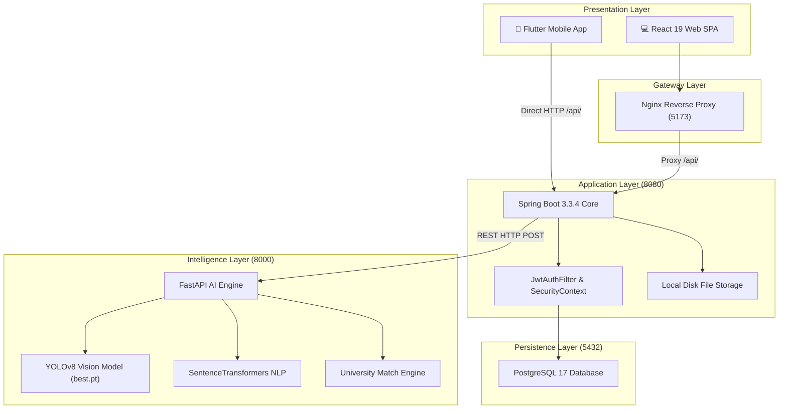

# System Architecture Specification — JanNirikshan (SIH26043)

## 1. High-Level Architecture Overview

JanNirikshan utilizes a multi-tier microservice architecture separated into four discrete runtime containers coordinated via Docker Compose on the `jannirikshan_net` bridge network:

1. **Client Tier**:
   - **React 19 Web Single Page Application (SPA)**: Serves municipal officers, university administrators, faculty researchers, students, and industrial partners.
   - **Flutter Mobile Application**: Native Android application designed for rapid citizen crowdsourcing with camera, GPS, and onboard AI verification.
2. **Reverse Proxy & Gateway Tier (Port 5173)**:
   - **Nginx Alpine**: Delivers static production frontend assets and reverse-proxies `/api/` calls directly to the Spring Boot application container.
3. **Application & Business Logic Tier (Port 8080)**:
   - **Spring Boot 3.3.4 (Java 17)**: Handles JWT authentication, domain validation, role authorization, file system persistence, and orchestrates downstream AI inference calls.
4. **Data Persistence Tier (Port 5432)**:
   - **PostgreSQL 17**: Persists users, citizen profiles, complaints, evidence metadata, AI predictions, duplicate graphs, projects, milestones, and funding.
5. **AI Intelligence Tier (Port 8000)**:
   - **FastAPI Microservice (Python 3.11)**: Executes deep learning computer vision (Ultralytics YOLOv8), NLP embeddings (`all-MiniLM-L6-v2`), duplicate detection, priority prediction, and university capability matching.

